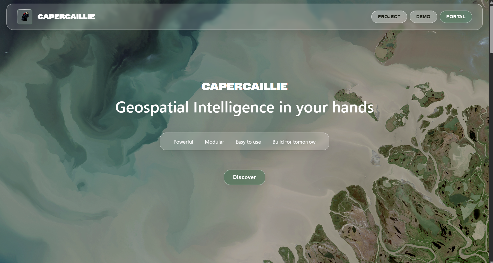
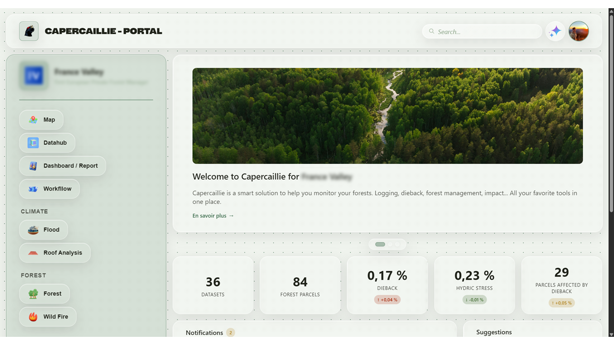
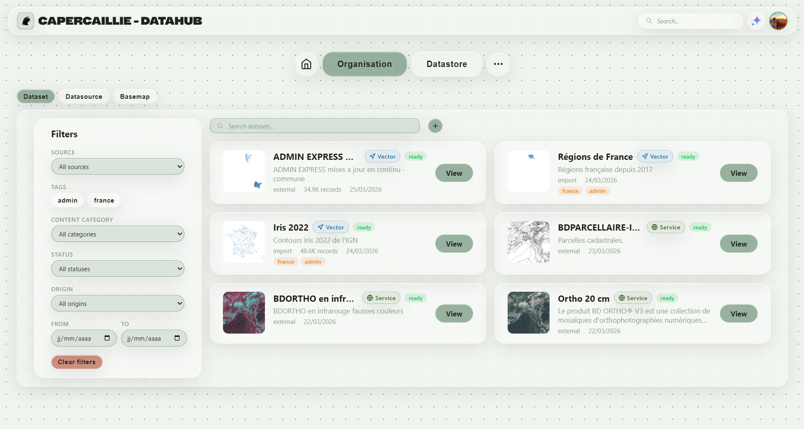
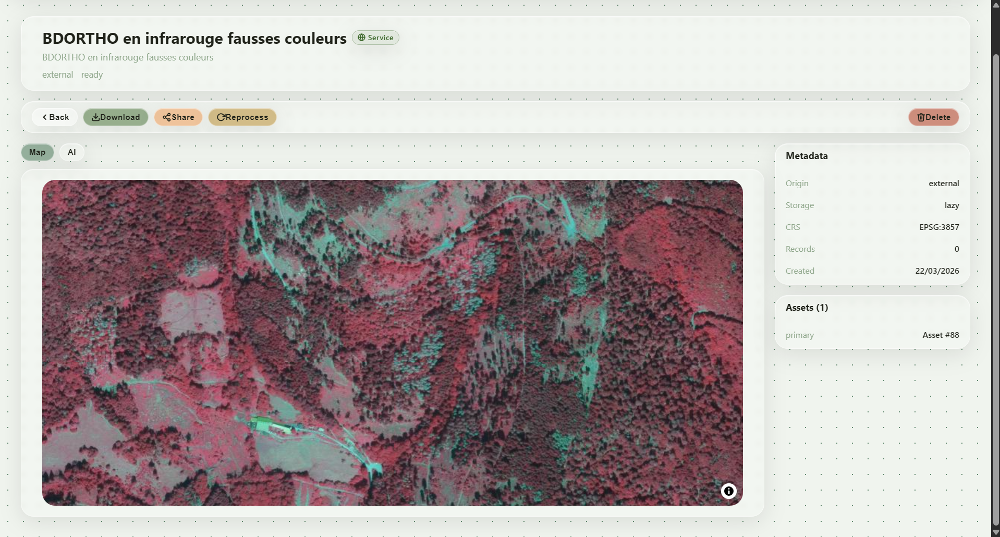
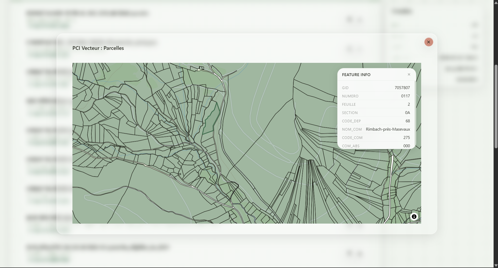
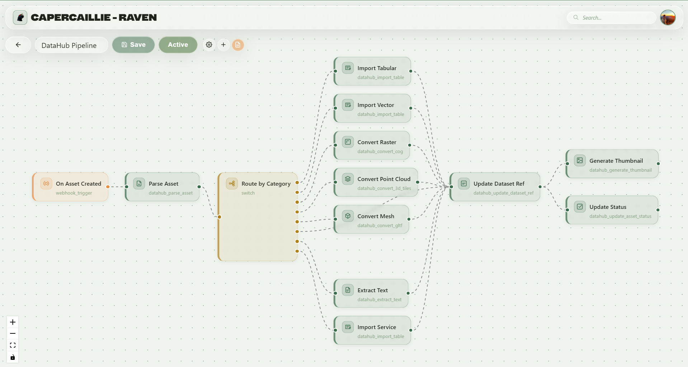
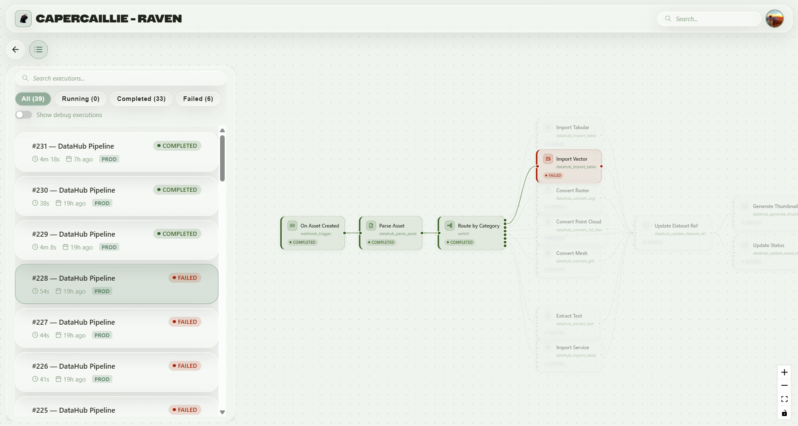
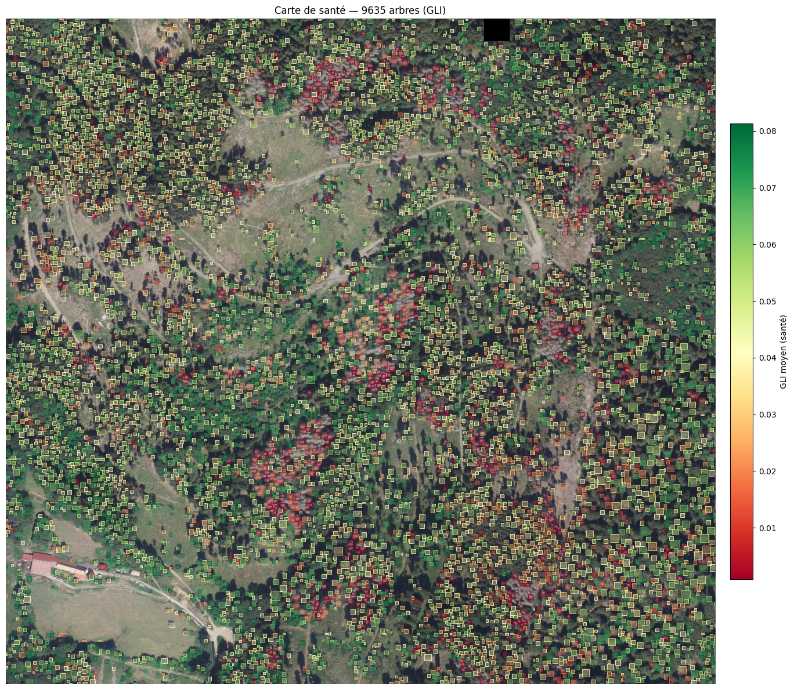

# Capercaillie

**Geospatial Intelligence in your hands**

[Website](https://capercaillie.fr)

A SaaS platform for territorial and environmental data analysis — built for enterprises, local authorities, and environmental agencies.



---

## What is Capercaillie?

Capercaillie is a **full-stack geospatial platform** built from scratch. It allows organisations to centralize, analyze, and visualize their territorial data — forest health monitoring, land-use planning, environmental impact assessment — all through a modern, multi-tenant web application.

At its core, Capercaillie is a **technical engine** — a high-performance sandbox for ingesting, processing, analyzing, and visualizing geospatial data at scale. The DataHub handles multi-format storage and serving (raster, vector, point clouds, meshes), while Raven orchestrates complex processing pipelines as visual DAGs. Together, they form a powerful, extensible backbone that can be plugged into any domain.

On top of this engine, **domain modules** will provide turnkey experiences for end users — no technical skills required. Each module is a clean, modern interface tailored to a specific use case (forestry, urban planning, environmental monitoring...) that handles the full workflow behind the scenes: fetching data from external sources, running analysis pipelines, and delivering results as interactive maps, dashboards, automated reports, or notifications (email, alerts). The goal is to make complex geospatial intelligence accessible to anyone, from field agents to decision makers.

Capercaillie is **100% compatible with the Model Context Protocol (MCP)**, meaning any MCP-enabled AI assistant can connect to the platform and interact with your geospatial data, trigger workflows, or query analysis results — seamlessly and out of the box.

The project is currently at an **early stage**. An alpha version featuring the first domain module — **Forestry** — will be available at the start of fall 2026.

This repo serves as a public showcase. The codebase is private, but here's an overview of the architecture, features, and technologies involved.

---

## Key Features

### Portal — Organisation Dashboard

The authenticated portal gives each organisation a bird's-eye view of their data: dataset count, forest parcels, dieback indicators, hydric stress metrics, and actionable notifications.



### DataHub — Geospatial Data Catalog

A full-featured data catalog where users can browse, filter, preview, and manage geospatial datasets. Supports multiple data types: raster imagery (WMTS), vector layers (WFS), point clouds, tabular data, and 3D meshes.



Each dataset comes with rich metadata, live map previews, and the ability to download, store, or reprocess the data directly from the interface.

| Raster Preview (WMTS) | Vector Preview (WFS) |
|---|---|
|  |  |

### Raven — Visual Workflow Engine

Raven is a **node-based workflow engine** I designed for building automated data pipelines. Users define processing graphs visually — triggers, routing, transformations, imports — and the system executes them asynchronously with full observability.



Each execution is tracked in real time with status indicators, error highlighting, and execution history.



### Geospatial Analysis

The platform integrates advanced geospatial analysis capabilities, including tree-level health mapping using satellite and aerial imagery (NDVI-based vegetation indices).



---

## Architecture

Capercaillie follows a **microservices architecture** inside a monorepo:

```
capercaillie/
├── api/
│   ├── admin/          # Auth, users, organisations (FastAPI)
│   ├── file/           # Multi-tenant file storage (FastAPI)
│   ├── mcp/            # AI integration via Model Context Protocol
│   └── client/         # Per-org business logic (FastAPI)
├── client/
│   ├── web/            # Public landing page (Lit + Vite)
│   ├── portal/         # Authenticated SPA (Lit + TypeScript)
│   └── login/          # Auth & org selection (Lit)
├── package/
│   ├── capercailliepy/ # Shared Python: ORM models, schemas, CRUD, services
│   ├── capercailliex/  # Web Components library (17+ components, Storybook)
│   └── capercaillie-tool/ # Workflow engine components (triggers, operators)
├── db-manager/         # DB admin dashboard (Streamlit)
├── admin-manager/      # Org data management (Streamlit)
└── docker-compose.yml
```

### Design Decisions

- **Multi-tenancy** — Organisation-scoped data isolation at every layer (DB, API, file storage)
- **Three-schema database** — Admin, Data, and Client schemas with independent Alembic migrations
- **JWT RS256 auth** — Access/refresh token pattern with session tracking
- **Shared packages** — Single source of truth for models, schemas, and UI components across all services

---

## Tech Stack

| Layer | Technologies |
|---|---|
| **Backend** | Python, FastAPI, SQLAlchemy 2.0, Pydantic, Alembic |
| **Frontend** | TypeScript, Lit Web Components, Vite, Storybook |
| **Database** | PostgreSQL + PostGIS (multi-schema) |
| **Auth** | JWT (RS256), bcrypt, HTTP-only cookies |
| **Infra** | Docker, Docker Compose, pnpm workspaces, Poetry |
| **AI** | Model Context Protocol (MCP) server |
| **Geospatial** | PostGIS, WFS/WMTS services, NDVI analysis |

---

## Status

This project is under active development — covering architecture design, backend APIs, frontend components, database modeling, DevOps, and geospatial data processing.

Feel free to reach out if you'd like to learn more or discuss the project.
